Tile Based WebGL Deferred Shader
----------------------------------------

[Yuqin](https://github.com/yuqinshao) & [Sijie](https://github.com/tiansijie)

* Sijie's twitter: https://twitter.com/sijietian
* Yuqin's twitter: https://twitter.com/YuqinShao

Overview
--------------------------------------------
Deferred shading, a screen-space shading technique, which enables fast and complex light resource management, has been more and more widely used in game industry. However, it seems this technique has much less use on WebGL.
In this project, we are trying to implement an advanced deferred shader on WebGL as well as to achieve some non-photorealistic rendering effects. Besides, in order to accelerate the whole process, we plan to implement the tile based deferred shading. Having these features, we can make games like Borderland on Web.

Some of the rendered results:

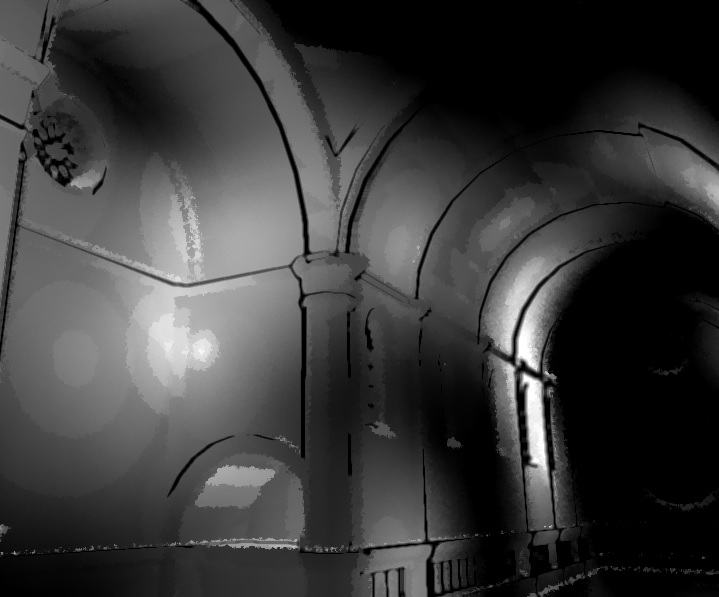

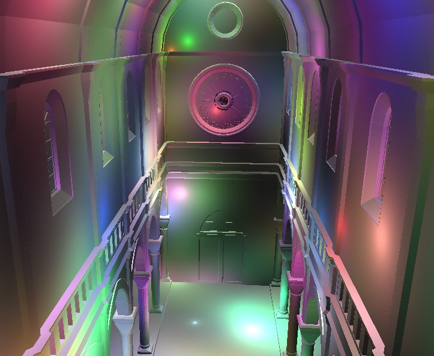

## Live Demo ##

[updated] Now our live demo support more browsers even without `WEBGL_draw_buffers`.

Please make sure your web browser support these WebGL extensions before you run it. `OES_texture_float`, `OES_texture_float_linear`, `WEBGL_depth_texture` and `WEBGL_draw_buffers`

[NPR Deferred Shading Live Demo](http://sijietian.com//WebGL/deferredshading/index.html)

## How to Use ##
- 1 depth render
- 2 normal render
- 3 position render
- 4 color render
- 5 one light scene
- 6 tile based deferred shading
- 7 non tile based deferred shading
- 8 NPR with tile based deferred shading
- Drag mouse to changed view direction
- Use w,s,a,d to move forward, backward, left and right
- Use q, e to move up and down.

## Video ##
[http://youtu.be/od9kJC089BI](http://youtu.be/od9kJC089BI)

## Algorithm Details ##

- Tile-based deferred shading on WebGL
	
	The first part of this project is an Tile-based deferred shading on WebGL. To implement this on WebGL, first we need several WebGL extensions, including `OES_texture_float`, `OES_texture_float_linear`, `WEBGL_depth_texture` and `WEBGL_draw_buffers`. To turn on these extensions, you need to turn on the `Enable WebGL Draft Extensions` on your browser. For chrome, you could enter 
	`chrome://flags` to find this option. On Windows, you also need to turn on `D3D11` on your chrome. In firefox, you could enter `about:config` to find it. Then, you could test it if you have these extensions on you browser by using [webglreport.com](webglreport.com). It mainly depends on your OS and  graphic card.

	Tile-based deferred shading is an optimization on deferred shading. The problem in deferred shading is that when the lights are overlapped, shaders read same Geometry buffer multiply times. This highly increase the bandwidth. In order to reduce bandwidth usage, tile-based deferred shading groups lights in each tile and read Geometry buffer only once.

	In this project, we consider each light as a sphere. We first separate the screen to tile, e.g 32x32. Then, we cull the light using screen space bounding box and insert into each tile. In order to pass suitable data to shader, we need some special data structure as shows in Figure 1. After we get these array, we pass to shader as texture and compute the light accumulation in shader.

	
	
	Figure 1(Figure from [Tiled Shading](http://www.cse.chalmers.se/~uffe/tiled_shading_preprint.pdf))

	You could see the performance evaluation part to see the speed up by using this method.

	We also try to do some optimization on tile-based deferred shading like using the depth range to cull light more aggressive. However, this project is based on WebGL 1.0, which has a lot limitations. The WebGL 1.0 is not support reading data form depth buffer. We work around this issue using `gl.readPixels`. Again, the WebGL only support `UNSIGNED_BYTE`, which return a very unaccurate result and enormous reduce the frame rate.

- NPR Chinese painting effect
	
	The NPR effects we are trying to achieve in this project is the Chinese Painting Effects. Basically, what we do includes two steps which are silhouette and stroke simulation as well as interior ink shading. 

	

	- Silhouette Extraction
	
		A silhouette edge is an edge adjacent to one front-facing and one back-facing polygon. A polygon is defined as front-facing if the dot product of its outward normal and a vector from the camera position to a point on the polygon is negative. Otherwise the polygon is back-facing. We use the object based extractio method to get all silhouette edges. And render them as seprate mesh object with webgl DRAW_LINE function.

	
	- Silhouette Culling
	
		Since we are drawing silhouette as separate mesh. It’s impossible for us to use the webgl’s depth buffer for back silhouette culling.  Thus, we’ll have to write it by ourselves.In our method, we need three framebuffer textures for the final result. First two textures stroe values of silhouette edges color pass(without culling) and silhouette edges’ depth buffer values respectively. The third pass we store the depth buffer value of the original triangle mesh. In the final post fragment shader, before we set the final fragment color, we first compare the depth value of the edges’ depth texture and the original mesh’s depth texture and only render out the color that pass the depth buffer.

	- Stroke rendering
			
		In the fragment shader, we first make pixels that around silhouette edge to be the same color as of silhouette edge to make silhouette edges thicker. And in the final step, we use Gaussian blur method to blur the current stroke and finally make them blend with the interior color. 
	
	- Ink Shading

		Interior shading could be a separate step from the stroke rendering. This step only need us to work on shaders instead of creating complex data structure with javascript.
		
*	Stroke rendering

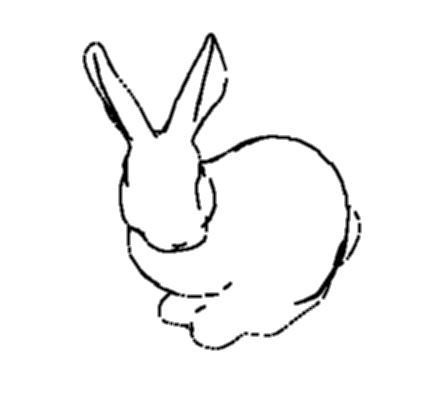	

*	Quantization Step

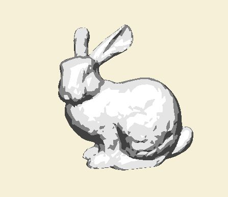	

*	Spattering Step

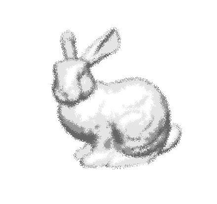

*	Final Result Step
	

## Performance Evaluation ##

We did several performance evaluations on Tile based with different number of lights and different size of the tile. As we can see from the first chart, the tile based method basically can speed up by 10 fps than the originally method. There are not much different on 16x16 and 32x32. However, if the tile is too big or too small, the frame rate decrease very quickly. 

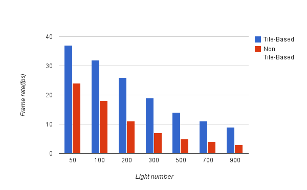

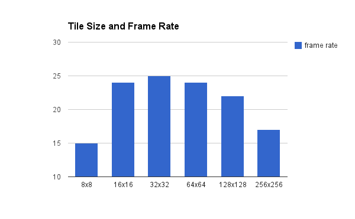

Chinese painting effect with and without stroke 

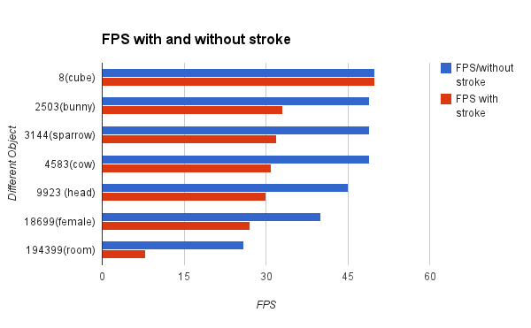

## Screen Shots ##

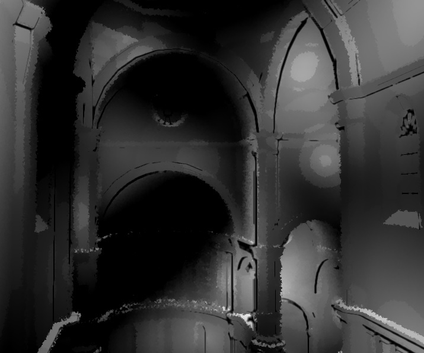

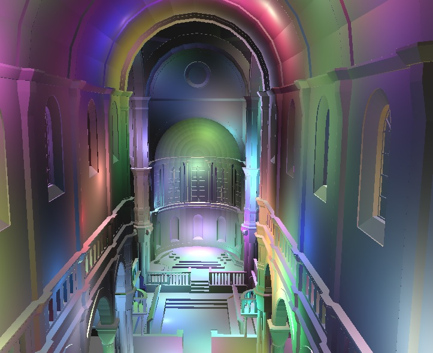

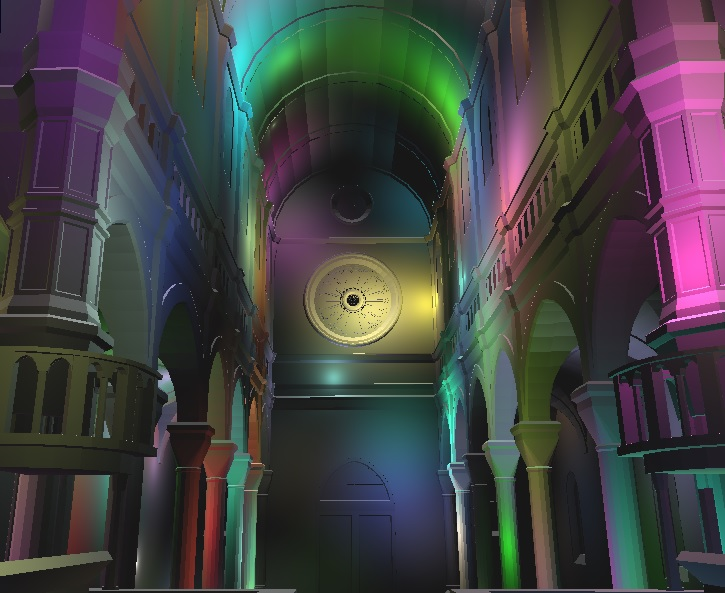

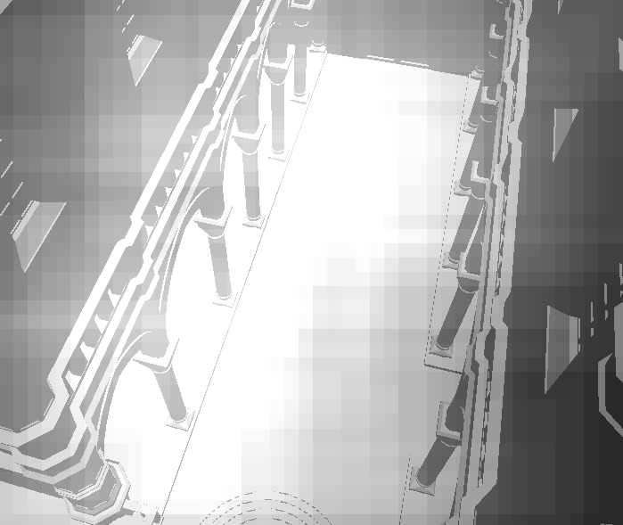

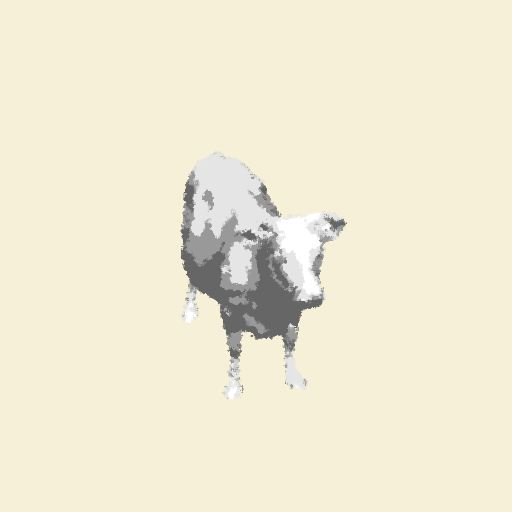

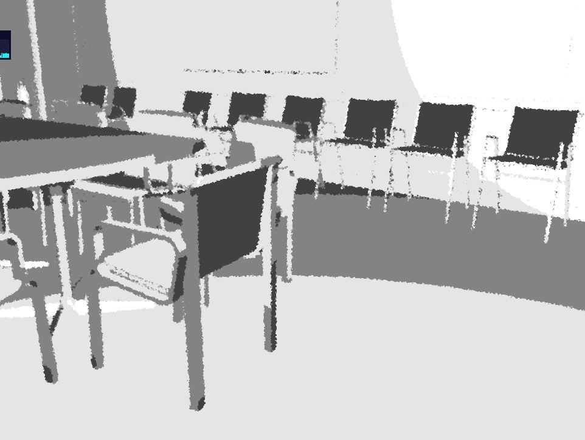

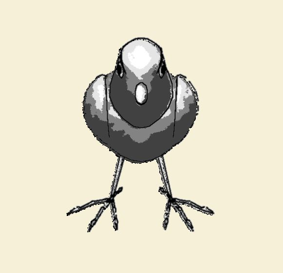

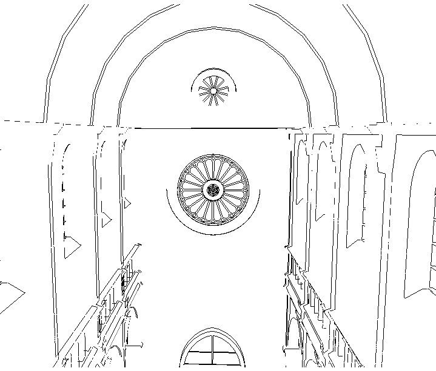

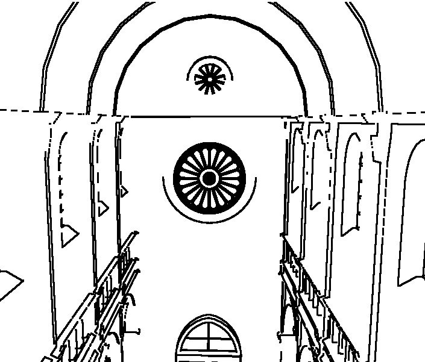

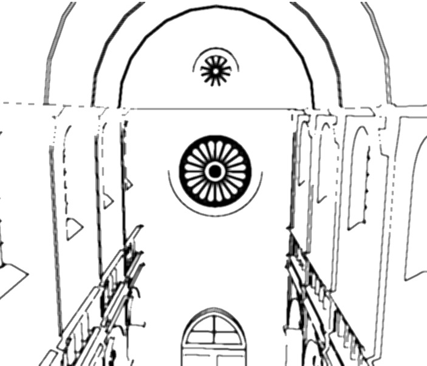

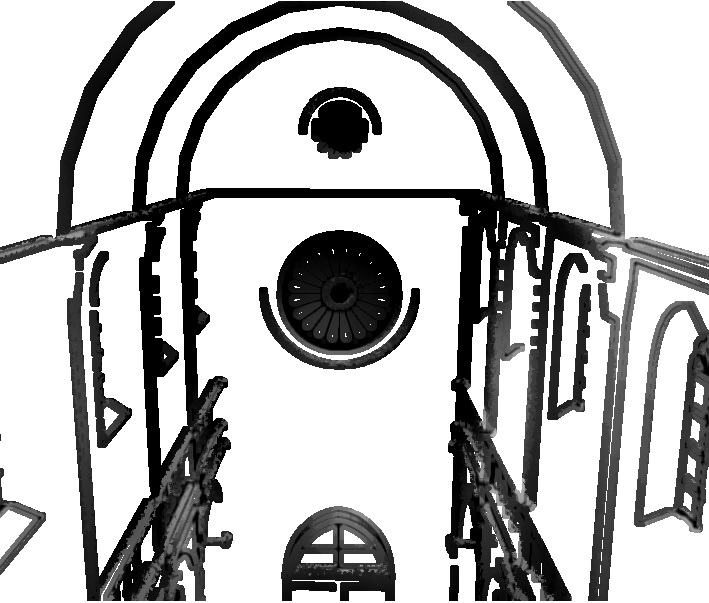

Note
-------------------------------------------
Make sure your browser's setting is correct in order to run this project.

Check the below link.

https://github.com/mrdoob/three.js/wiki/How-to-run-things-locally 

The easiest way is to use the firefox.
* Go to about:config
* Find security.fileuri.strict_origin_policy parameter
* Set it to false

References
---------------------------------------------------------------
* [A demo of webgl deferred shading](http://codeflow.org/entries/2012/aug/25/webgl-deferred-irradiance-volumes/#!)
* [Tile based deferred shading](http://bps10.idav.ucdavis.edu/talks/12-lauritzen_DeferredShading_BPS_SIGGRAPH2010_Notes.pdf) 
* Very useful resource for tile shading [Tile Shading](http://www.cse.chalmers.se/~uffe/tiled_shading_preprint.pdf)

Third Party Library
-------------------------------------------------
[Three.js](http://threejs.org/) for obj loader

