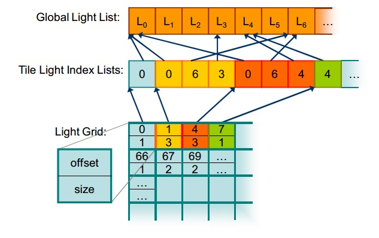
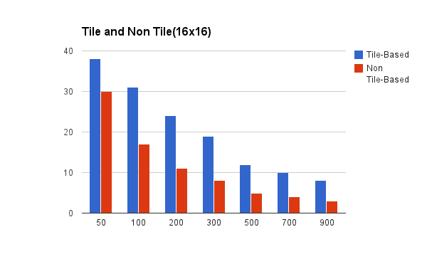

Tile Based WebGL Deferred Shader
----------------------------------------
[Yuqin](https://github.com/yuqinshao) & [Sijie](https://github.com/tiansijie)

* Sijie's twitter: https://twitter.com/sijietian
* Yuqin's twitter: https://twitter.com/YuqinShao

-------------------------------------------------------------------------------

Overview
--------------------------------------------
Deferred shading, a screen-space shading technique, which enables fast and complex light resource management, has been more and more widely used in game industry. However, it seems this technique has much less use on WebGL.
In this project, we are trying to implement an advanced deferred shader on WebGL as well as to achieve some non-photorealistic rendering effects. Besides, in order to accelerate the whole process, we plan to implement the tile based deferred shading. Having these features, we can make games like Borderland on Web.

## Description ##

- Tile-based deferred shading on WebGL
	
	The first part of this project is an Tile-based deferred shading on WebGL. To implement this on WebGL, first we need several WebGL extensions, including `OES_texture_float`, `OES_texture_float_linear`, `WEBGL_depth_texture` and `WEBGL_draw_buffers`. To turn on these extensions, you need to turn on the `Enable WebGL Draft Extensions` on your browser. For chrome, you could enter 
	`chrome://flags` to find this option. On Windows, you also need to turn on `D3D11` on your chrome. In firefox, you could enter `about:config` to find it. Then, you could test it if you have these extensions on you browser by using [webglreport.com](webglreport.com). It mainly depends on your OS and  graphic card.

	Tile-based deferred shading is an optimization on deferred shading. The problem in deferred shading is that when the lights are overlapped, shaders read same Geometry buffer multiply times. This highly increase the bandwidth. In order to reduce bandwidth usage, tile-based deferred shading groups lights in each tile and read Geometry buffer only once.

	In this project, we consider each light as a sphere. We first separate the screen to tile, e.g 32x32. Then, we cull the light using screen space bounding box and insert into each tile. In order to pass suitable data to shader, we need some special data structure as shows in Figure 1. After we get these array, we pass to shader as texture and compute the light accumulation in shader.

	
	Figure 1(Figure from [Tiled Shading](http://www.cse.chalmers.se/~uffe/tiled_shading_preprint.pdf))

	You could see the performance evaluation part to see the speed up by using this method.

	We also try to do some optimization on tile-based deferred shading like using the depth range to cull light more aggressive. However, this project is based on WebGL 1.0, which has a lot limitations. The WebGL 1.0 is not support reading data form depth buffer. We work around this issue using `gl.readPixels`. Again, the WebGL only support `UNSIGNED_BYTE`, which return a very unaccurate result and enormous reduce the frame rate.

## Performance Evaluation ##

We did several performance evaluations on Tile based with different number of lights and different size of the tile. As we can see from the first chart, the tile based method basically can speed up by 10 fps than the originally method. There are not much different on 16x16 and 32x32. However, if the tile is too big or too small, the frame rate decrease very quickly. 

Note
-------------------------------------------
Make sure your browser's setting is correct in order to run this project.

Check the below link.

https://github.com/mrdoob/three.js/wiki/How-to-run-things-locally 

The easiest way is to use the firefox.
* Go to about:config
* Find security.fileuri.strict_origin_policy parameter
* Set it to false

Details
---------------------------------------------------------------
* We use webgl [WEBGL_depth_texture](http://www.khronos.org/registry/webgl/extensions/WEBGL_depth_texture/) exension, and here is a very good [example](http://blog.tojicode.com/2012/07/using-webgldepthtexture.html) to show how to use this extension 
* We also use [OES_texture_float](http://www.khronos.org/registry/webgl/extensions/OES_texture_float/) which suports floating type texture in WebGL.

Useful links
----------------------------
* [Mesh resources](http://graphics.cs.williams.edu/data/meshes.xml)
* 

Development Log
-------------------------------
Silhouette Culling Step [FAILED]
Since we are drawing silhouette based on the object. We cannot use webgl's own depth test to cull those back silhouette. So, based on the paper, we'll have to implement the silhouette culling step by ourselves.
What the paper did is to store the 2d position of both end points of the edge as well as the depth value in the data structure. And use the depth buffer data to compare. If pass didn't pass the depth test, then eliminate the edge.
However, webgl is only 1.0 version which means it has a lot of limitations.
For example, in order to get the depth value from depth buffer, I'll have to use the function readpixels. This function, the problem is that the function supported by webgl can only receive UNSIGNED_BYTE data type. Which means all the floating point data supposed to be pass out will be clamped into integers, which results in a very big, unignorable error. 

Since in order to achieve the effect we want, we just cannot ignore the silhouette culling step. Thus, the solution (the only solution) I'm thinking of is that:

first render the non-culled silhouette into framebuffer. And render the depth value of those points into another framebuffer as well.
Also render the depth value of the triangle mesh into a third framebuffer.
And based on this three texture, draw the final image with quad. Just like what deferred is doing. 
This method may solve the problem visually. However, it will end up with a low speed, probably when the scene becomes more complicated.:(
But compared with no back silhouette culling, this could be a good solution :) 

References
---------------------------------------------------------------
* [A demo of webgl deferred shading](http://codeflow.org/entries/2012/aug/25/webgl-deferred-irradiance-volumes/#!)
* [Tile based deferred shading](http://bps10.idav.ucdavis.edu/talks/12-lauritzen_DeferredShading_BPS_SIGGRAPH2010_Notes.pdf) 
* Very useful resource for tile shading [Tile Shading](http://www.cse.chalmers.se/~uffe/tiled_shading_preprint.pdf)

Third Party
-------------------------------------------------

